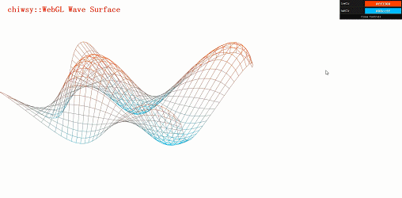
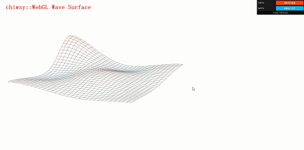
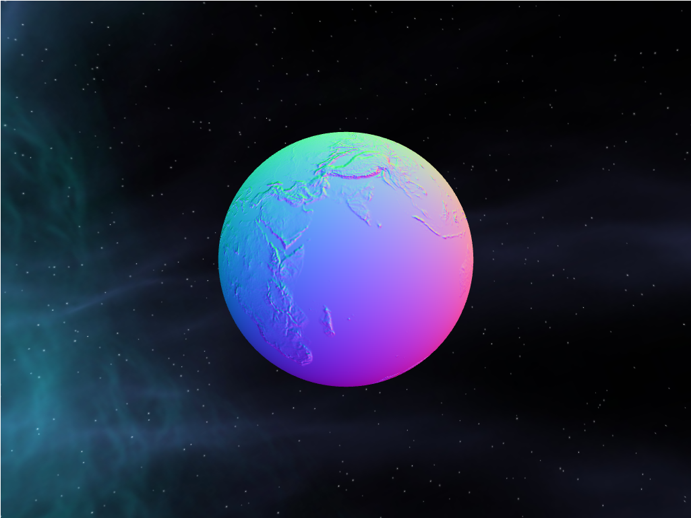
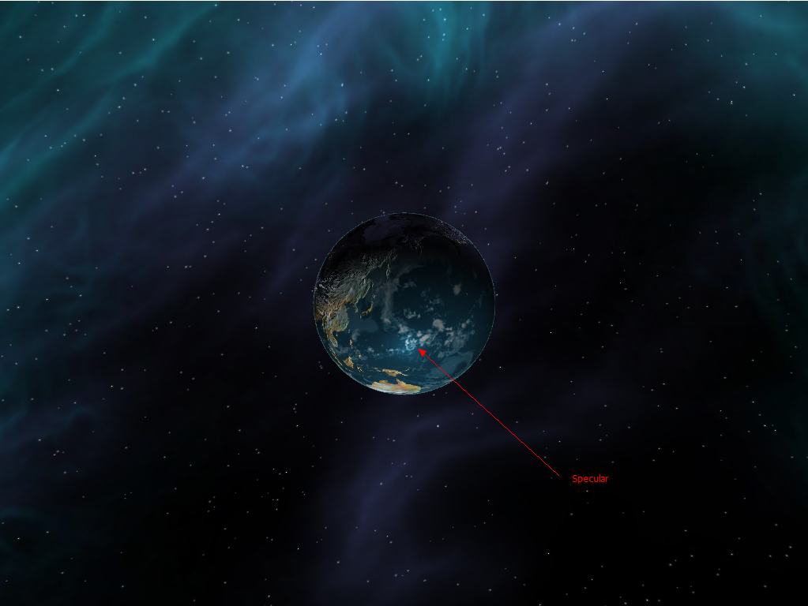

-------------------------------------------------------------------------------
CIS565: Project 5: WebGL
-------------------------------------------------------------------------------
Fall 2014
-------------------------------------------------------------------------------
Due Monday 11/03/2014
-------------------------------------------------------------------------------

-------------------------------------------------------------------------------
NOTE:
-------------------------------------------------------------------------------
This project requires any graphics card with support for a modern OpenGL 
pipeline. Any AMD, NVIDIA, or Intel card from the past few years should work 
fine.

This project also requires a WebGL capable browser. The project is known to 
have issues with Chrome on windows, but Firefox seems to run it fine.

-------------------------------------------------------------------------------
INTRODUCTION:
-------------------------------------------------------------------------------
In this project, I implemented a simple sine wave and one Sinc function wave in 3D space. 

In the second part of this project, a digital global is inplemented.

Here are some result:

-------------------------------------------------------------------------------
CONTENTS:
-------------------------------------------------------------------------------

-------------------------------------------------------------------------------
PART 1 Implementations:
-------------------------------------------------------------------------------

In Part 1, base code are given for:

* Drawing a VBO through WebGL
* Javascript code for interfacing with WebGL
* Functions for generating simplex noise

You are required to implement the following:

* A sin-wave based vertex shader:

* A sinc function has also been implemented. The sinc function is widly used in digital signal processing. It has one singular point at its peak. As we know in calculus the result should be 1.

-------------------------------------------------------------------------------
PART 2 Implementations:
-------------------------------------------------------------------------------
In Part 2, the base code are given for:

* Reading and loading textures
* Rendering a sphere with textures mapped on
* Basic passthrough fragment and vertex shaders 
* A basic globe with Earth terrain color mapping
* Gamma correcting textures
* javascript to interact with the mouse
  * left-click and drag moves the camera around
  * right-click and drag moves the camera in and out

I have implemented:

* Bump mapped terrain
* Rim lighting to simulate atmosphere
* Night-time lights on the dark side of the globe
* Specular mapping
* Moving clouds

* Draw a skybox around the entire scene for the stars.

Here are some interesting results and I marked some features to high light what I have implemented:

-------------------------------------------------------------------------------
PERFORMANCE EVALUATION
-------------------------------------------------------------------------------
This global system seems a very low weight. I have turn on and off skybox, bump map, specular, cloud, etc. and the FPS is always 59~61. 

